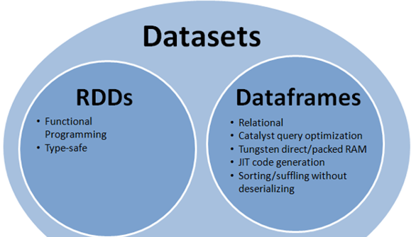

# SparkSQL

## 第1章 Spark SQL概述

### 1.1 什么是Spark SQL

​		Spark SQL是Spark用来处理结构化数据的一个模块，它提供了2个编程抽象：**DataFrame**和**DataSet**，并且作为分布式SQL查询引擎的作用。

​		我们已经学习了Hive，它是将Hive SQL转换成MapReduce然后提交到集群上执行，大大简化了编写MapReduc的程序的复杂性，由于MapReduce这种计算模型执行效率比较慢。所有Spark SQL的应运而生，它是将Spark SQL转换成RDD，然后提交到集群执行，执行效率非常快！

### 1.2 Spark SQL特点

1. 易整合

	

2. 统一的数据访问方式

	

3. 兼容Hive

	

4. 标准的数据连接

	

### 1.3 什么是DataFrame

​		与RDD类似，**DataFrame**也是一个分布式数据容器。然而**DataFrame**更像传统数据库的二维表格，除了数据以外，还记录数据的**结构信息**，即**schema**。同时，与Hive类似，DataFrame也支持嵌套数据类型（struct、array和map）。从API易用性的角度上看，DataFrame API提供的是一套高层的关系操作，比函数式的RDD API要更加友好，门槛更低。


​		上图直观地体现了DataFrame和RDD的区别。左侧的RDD[Person]虽然以Person为类型参数，但Spark框架本身不了解Person类的内部结构。而右侧的DataFrame却提供了详细的结构信息，使得Spark SQL可以清楚地知道该数据集中包含哪些列，每列的名称和类型各是什么。			

​		DataFrame是为数据提供了Schema的视图。可以把它当做数据库中的一张表来对待，**DataFrame也是懒执行的**。**性能上比RDD要高**，主要原因：

​		**优化的执行计划**：查询计划通过**Spark catalyst optimiser**进行优化。


+ 例如

	


​		为了说明查询优化，我们来看上图展示的人口数据分析的示例。图中构造了两个DataFrame，将它们join之后又做了一次filter操作。如果原封不动地执行这个执行计划，最终的执行效率是不高的。因为join是一个代价较大的操作，也可能会产生一个较大的数据集。如果我们能将filter下推到 join下方，先对DataFrame进行过滤，再join过滤后的较小的结果集，便可以有效缩短执行时间。而Spark SQL的查询优化器正是这样做的。简而言之，**逻辑查询计划优化**就是一个利用**基于关系代数的等价变换**，将高成本的操作替换为低成本操作的过程。 

### 1.4 什么是DataSet

1. 是**Dataframe API**的一个扩展，是Spark最新的数据抽象。
2. 用户友好的API风格，既具有**类型安全检查**也具有**Dataframe的查询优化特性**。
3. Dataset支持编解码器，当需要访问非堆上的数据时可以避免反序列化整个对象，提高了效率。
4. 样例类被用来在Dataset中定义数据的结构信息，样例类中每个属性的名称直接映射到DataSet中的字段名称。
5. **Dataframe是Dataset的特列**，**DataFrame=Dataset[Row]** ，所以可以通过as方法将Dataframe转换为Dataset。Row是一个类型，跟Car、Person这些的类型一样，所有的表结构信息我都用Row来表示。
6. DataSet是强类型的。比如可以有Dataset[Car]，Dataset[Person].

7. DataFrame只是知道字段，但是不知道字段的类型，所以在执行这些操作的时候是没办法在编译的时候检查是否类型失败的，比如你可以对一个String进行减法操作，在执行的时候才报错，而DataSet不仅仅知道字段，而且知道字段类型，所以有更严格的错误检查。就跟JSON对象和类对象之间的类比。

## 第2章 Spark SQL编程

### 2.1 SparkSession 新的起始点

​		在老的版本中，SparkSQL提供两种SQL查询起始点：一个叫SQLContext，用于Spark自己提供的SQL查询；一个叫HiveContext，用于连接Hive的查询。

​		SparkSession是Spark最新的SQL查询起始点，实质上是SQLContext和HiveContext的组合，所以在SQLContext和HiveContext上可用的API在SparkSession上同样可以使用。SparkSession内部封装了sparkContext，所以计算实际上是由sparkContext完成的。

### 2.2 DataFrame

#### 2.2.1 创建

​		在Spark SQL中SparkSession是创建DataFrame和执行SQL的入口，创建DataFrame有三种方式：通过Spark的数据源进行创建；从一个存在的RDD进行转换；还可以从Hive Table进行查询返回。

1. **从Spark数据源进行创建**

	+ 查看Spark数据源进行创建的文件格式

		```scala
		scala> spark.read.
		csv   format   jdbc   json   load   option   options   orc   parquet   schema   table   text   textFile
		```

	+ 读取json文件创建DataFrame

		```scala
		scala> val df = spark.read.json("/opt/module/spark/examples/src/main/resources/people.json")
		df: org.apache.spark.sql.DataFrame = [age: bigint, name: string]
		```

	+ 展示结果

		```scala
		scala> df.show
		+----+-------+
		| age|   name|
		+----+-------+
		|null|Michael|
		|  30|   Andy|
		|  19| Justin|
		+----+-------+
		```

2. **从RDD进行转换**

3. **从Hive Table查询返回**

#### 2.2.2 SQL风格语法

1. **创建一个DataFrame**

	```scala
	scala> val df = spark.read.json("/opt/module/spark/examples/src/main/resources/people.json")
	df: org.apache.spark.sql.DataFrame = [age: bigint, name: string]
	```

2. **对DataFrame创建一个临时表**

	```scala
	scala> df.createOrReplaceTempView("people")
	```

3. **通过SQL语句实现查询全表**

	```scala
	scala> val sqlDF = spark.sql("SELECT * FROM people")
	sqlDF: org.apache.spark.sql.DataFrame = [age: bigint, name: string]
	```

4. **结果展示**

	```scala
	scala> sqlDF.show
	+----+-------+
	| age|   name|
	+----+-------+
	|null|Michael|
	|  30|   Andy|
	|  19| Justin|
	+----+-------+
	```

	**注意：**临时表是Session范围内的，Session退出后，表就失效了。如果想应用范围内有效，可以使用全局表。注意使用全局表时需要全路径访问，如：global_temp.people

5. **对DataFrame创建一个全局表**

	```scala
	scala> df.createGlobalTempView("people")
	```

6. **通过SQL语句实现查询全表**

	```scala
	scala> spark.sql("SELECT * FROM global_temp.people").show()
	+----+-------+
	| age|   name|
	+----+-------+
	|null|Michael|
	|  30|   Andy|
	|  19| Justin|
	
	scala> spark.newSession().sql("SELECT * FROM global_temp.people").show()
	+----+-------+
	| age|   name|
	+----+-------+
	|null|Michael|
	|  30|   Andy|
	|  19| Justin|
	+----+-------+
	
	```

	

#### 2.2.3 DSL风格语法

​		注意：如果需要RDD与DF或者DS之间操作，那么都需要引入 import spark.implicits._ 

**【spark不是包名，而是sparkSession对象的名称**】

前置条件：**导入隐式转换并创建一个RDD**

```scala
scala> import spark.implicits._
import spark.implicits._
 
scala> val peopleRDD = sc.textFile("examples/src/main/resources/people.txt")
peopleRDD: org.apache.spark.rdd.RDD[String] = examples/src/main/resources/people.txt MapPartitionsRDD[3] at textFile at <console>:27
```

1. **通过手动确定转换**

```scala
scala> peopleRDD.map{x=>val para = x.split(",");(para(0),para(1).trim.toInt)}.toDF("name","age")
res1: org.apache.spark.sql.DataFrame = [name: string, age: int]
```

2. **通过反射确定**（需要用到样例类）

+ 创建一个样例类

```scala
scala> case class People(name:String, age:Int)
```

+ 根据样例类将RDD转换为DataFrame

```scala
scala> peopleRDD.map{ x => val para = x.split(",");People(para(0),para(1).trim.toInt)}.toDF
res2: org.apache.spark.sql.DataFrame = [name: string, age: int]
```

3. **通过编程的方式**（了解）

+ 导入所需的类型

```scala
scala> import org.apache.spark.sql.types._

import org.apache.spark.sql.types._
```

+ 创建Schema

```scala
scala> val structType: StructType = StructType(StructField("name", StringType) :: StructField("age", IntegerType) :: Nil)
structType: org.apache.spark.sql.types.StructType = StructType(StructField(name,StringType,true), StructField(age,IntegerType,true))
```

+ 导入所需的类型

```scala
scala> import org.apache.spark.sql.Row
import org.apache.spark.sql.Row
```

+ 根据给定的类型创建二元组RDD

```scala
scala> val data = peopleRDD.map{ x => val para = x.split(",");Row(para(0),para(1).trim.toInt)}
data: org.apache.spark.rdd.RDD[org.apache.spark.sql.Row] = MapPartitionsRDD[6] at map at <console>:33
```

+ 根据数据及给定的schema创建DataFrame

```scala
scala> val dataFrame = spark.createDataFrame(data, structType)
dataFrame: org.apache.spark.sql.DataFrame = [name: string, age: int]
```

#### 2.2.5 DateFrame转换为RDD

​		直接调用rdd即可

1. **创建一个DataFrame**

```scala
scala> val df = spark.read.json("/opt/module/spark/examples/src/main/resources/people.json")
df: org.apache.spark.sql.DataFrame = [age: bigint, name: string]
```

2. **将DataFrame转换为RDD**

```scala
scala> val dfToRDD = df.rdd
dfToRDD: org.apache.spark.rdd.RDD[org.apache.spark.sql.Row] = MapPartitionsRDD[19] at rdd at <console>:29
```

3. **打印RDD**

```scala
scala> dfToRDD.collect
res13: Array[org.apache.spark.sql.Row] = Array([Michael, 29], [Andy, 30], [Justin, 19])
```

### 2.3 DataSet

​		Dataset是具有强类型的数据集合，需要提供对应的类型信息。

#### 2.3.1 创建

1）**创建一个样例类**

```scala
scala> case class Person(name: String, age: Long)
defined class Person
```

2）**创建DataSet**

```scala
scala> val caseClassDS = Seq(Person("Andy", 32)).toDS()
caseClassDS: org.apache.spark.sql.Dataset[Person] = [name: string, age: bigint]
```

#### 2.3.2 RDD转换为DataSet

​		SparkSQL能够自动将包含有case类的RDD转换成DataFrame，case类定义了table的结构，case类属性通过反射变成了表的列名。

1. **创建一个RDD**

```scala
scala> val peopleRDD = sc.textFile("examples/src/main/resources/people.txt")
peopleRDD: org.apache.spark.rdd.RDD[String] = examples/src/main/resources/people.txt MapPartitionsRDD[3] at textFile at <console>:27
```

2. **创建一个样例类**

```scala
scala> case class Person(name: String, age: Long)
defined class Person
```

3. **将RDD转化为DataSet**

```scala
scala> peopleRDD.map(line => {val para = line.split(",");Person(para(0),para(1).trim.toInt)}).toDS()
```

#### 2.3.3 DataSet转换为RDD

​		调用rdd方法即可。

1. **创建一个DataSet**

```scala
scala> val DS = Seq(Person("Andy", 32)).toDS()
DS: org.apache.spark.sql.Dataset[Person] = [name: string, age: bigint]
```

2. **将DataSet转换为RDD**

```scala
scala> DS.rdd
res11: org.apache.spark.rdd.RDD[Person] = MapPartitionsRDD[15] at rdd at <console>:28
```

### 2.4 DataFrame与DataSet的互操作

1. **DataFrame转换为DataSet**

+ 创建一个DateFrame

```scala
scala> val df = spark.read.json("examples/src/main/resources/people.json")
df: org.apache.spark.sql.DataFrame = [age: bigint, name: string]
```

+ 创建一个样例类

```scala
scala> case class Person(name: String, age: Long)
defined class Person
```

+ 将DateFrame转化为DataSet

```scala
scala> df.as[Person]
res14: org.apache.spark.sql.Dataset[Person] = [age: bigint, name: string]
```

2. **DataSet转换为DataFrame**

+ 创建一个样例类

```scala
scala> case class Person(name: String, age: Long)
defined class Person
```

+ 创建DataSet

```scala
scala> val ds = Seq(Person("Andy", 32)).toDS()
ds: org.apache.spark.sql.Dataset[Person] = [name: string, age: bigint]
```

+ 将DataSet转化为DataFrame

```scala
scala> val df = ds.toDF
df: org.apache.spark.sql.DataFrame = [name: string, age: bigint]
```

+ 展示

```scala
scala> df.show
+----+---+
|name|age|
+----+---+
|Andy| 32|
+----+---+
```

#### 2.4.1 DataSet转DataFrame

​		这个很简单，因为只是把case class封装成Row

1. **导入隐式转换**

```scala
import spark.implicits._
```

2. **转换**

```scala
val testDF = testDS.toDF
```

#### 2.4.2 DataFrame转DataSet

1. 导入隐式转换

```scala
import spark.implicits._
```

2. 创建样例类

```scala
case class Coltest(col1:String,col2:Int)extends Serializable //定义字段名和类型
```

3. 转换

```scala
val testDS = testDF.as[Coltest]
```

​		这种方法就是在给出每一列的类型后，使用as方法，转成Dataset，这在数据类型是DataFrame又需要针对各个字段处理时极为方便。在使用一些特殊的操作时，一定要加上 import spark.implicits._ 不然toDF、toDS无法使用。

### 2.5 RDD、DataFrame、DataSet



​		在SparkSQL中Spark为我们提供了两个新的抽象，分别是DataFrame和DataSet。他们和RDD有什么区别呢？首先从版本的产生上来看：

​		RDD (Spark1.0) —> Dataframe(Spark1.3) —> Dataset(Spark1.6)

​		如果同样的数据都给到这三个数据结构，他们分别计算之后，都会给出相同的结果。不同是的他们的执行效率和执行方式。

​		在后期的Spark版本中，DataSet会逐步取代RDD和DataFrame成为唯一的API接口。

#### 2.5.1 共同点

1. RDD、DataFrame、Dataset全都是spark平台下的分布式弹性数据集，为处理超大型数据提供便利

2. 三者都有惰性机制，在进行创建、转换，如map方法时，不会立即执行，只有在遇到Action如foreach时，三者才会开始遍历运算。

3. 三者都会根据spark的内存情况自动缓存运算，这样即使数据量很大，也不用担心会内存溢出。

4. 三者都有partition的概念

5. 三者有许多共同的函数，如filter，排序等

6. 在对DataFrame和Dataset进行操作许多操作都需要这个包进行支持

	​	import spark.implicits._

7. DataFrame和Dataset均可使用模式匹配获取各个字段的值和类型

	**DataFrame**:

	```scala
	testDF.map{
	
	   case Row(col1:String,col2:Int)=>
	    println(col1);println(col2)
	    col1
	   case _=>
	    ""
	  }
	```

	**Dataset**:

	```scala
	case class Coltest(col1:String,col2:Int)extends Serializable //定义字段名和类型
	  testDS.map{
	   case Coltest(col1:String,col2:Int)=>
	    println(col1);println(col2)
	    col1
	   case _=>
	    ""
	  }
	```

#### 2.5.2 区别

1. **RDD**:
	1. RDD一般和spark mlib同时使用
	2. RDD不支持sparksql操作

2. **DataFrame**:

	1. 与RDD和Dataset不同，DataFrame每一行的类型固定为Row，每一列的值没法直接访问，只有通过解析才能获取各个字段的值，如：

	```scala
	testDF.foreach{
	 line =>
	  val col1=line.getAs[String]("col1")
	  val col2=line.getAs[String]("col2")
	}
	```

	2. DataFrame与Dataset一般不与spark mlib同时使用
	3. DataFrame与Dataset均支持sparksql的操作，比如select，groupby之类，还能注册临时表/视窗，进行sql语句操作，如：

	```scala
	dataDF.createOrReplaceTempView("tmp")
	spark.sql("select ROW,DATE from tmp where DATE is not null order by DATE").show(100,false)
	```

	4. DataFrame与Dataset支持一些特别方便的保存方式，比如保存成csv，可以带上表头，这样每一列的字段名一目了然

		**保存**

		```scala
		val saveoptions = Map("header" -> "true", "delimiter" -> "\t", "path" -> "hdfs://hadoop102:9000/test")
		
		datawDF.write.format("com.atguigu.spark.csv").mode(SaveMode.Overwrite).options(saveoptions).save()
		```

		**读取**

		```scala
		val options = Map("header" -> "true", "delimiter" -> "\t", "path" -> "hdfs://hadoop102:9000/test")
		
		val datarDF= spark.read.options(options).format("com.atguigu.spark.csv").load()
		```

		利用这样的保存方式，可以方便的获得字段名和列的对应，而且分隔符（delimiter）可以自由指定。

3. **Dataset**:

	1.Dataset和DataFrame拥有完全相同的成员函数，区别只是每一行的数据类型不同。

	2.DataFrame也可以叫Dataset[Row],每一行的类型是Row，不解析，每一行究竟有哪些字段，各个字段又是什么类型都无从得知，只能用上面提到的getAS方法或者共性中的第七条提到的模式匹配拿出特定字段。而Dataset中，每一行是什么类型是不一定的，在自定义了case class之后可以很自由的获得每一行的信息

	```scala
	case class Coltest(col1:String,col2:Int)extends Serializable //定义字段名和类型
	/**
	 rdd
	 ("a", 1)
	 ("b", 1)
	 ("a", 1)
	**/
	val test: Dataset[Coltest]=rdd.map{line=>
	   Coltest(line._1,line._2)
	  }.toDS
	test.map{
	   line=>
	     println(line.col1)
	     println(line.col2)
	  }
	```

	​		可以看出，Dataset在需要访问列中的某个字段时是非常方便的，然而，如果要写一些适配性很强的函数时，如果使用Dataset，行的类型又不确定，可能是各种case class，无法实现适配，这时候用DataFrame即Dataset[Row]就能比较好的解决问题.

