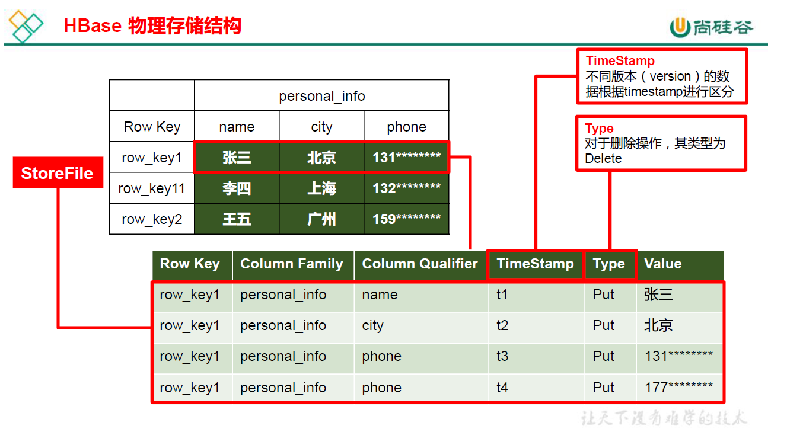
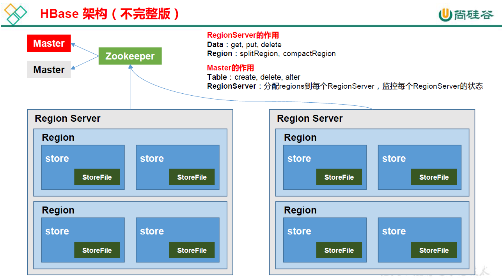
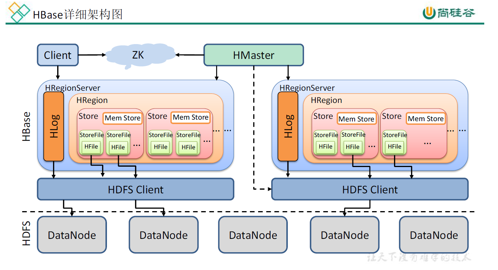
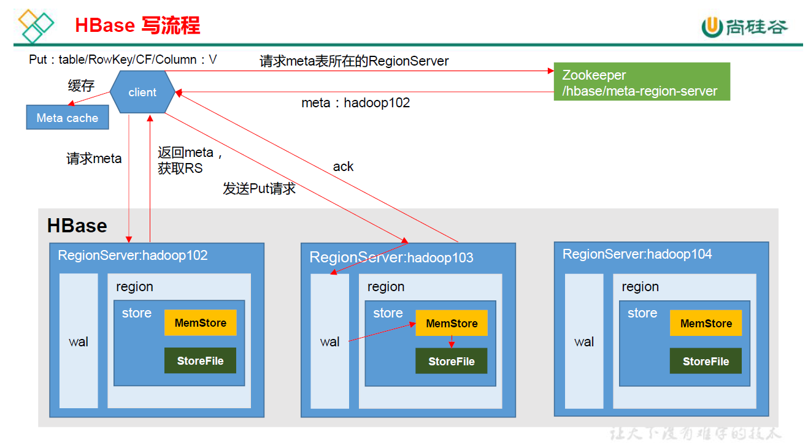
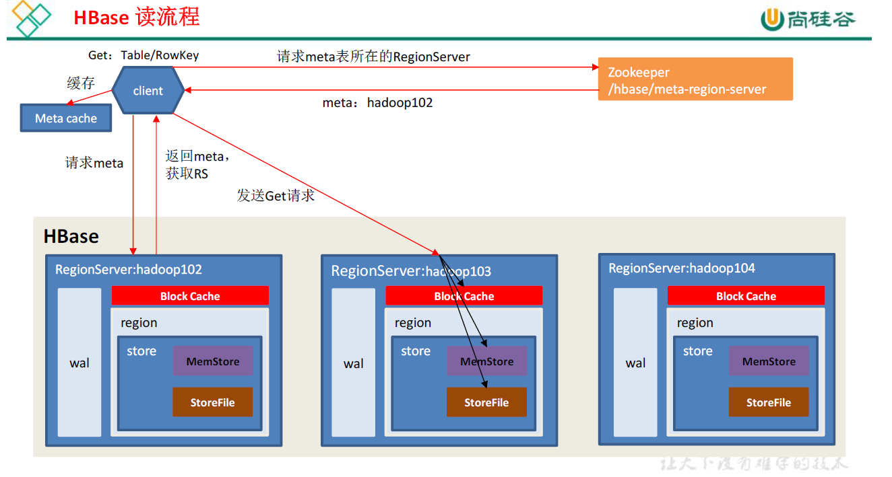
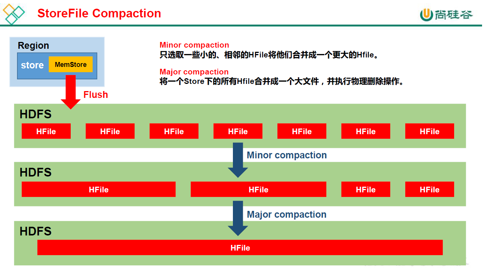
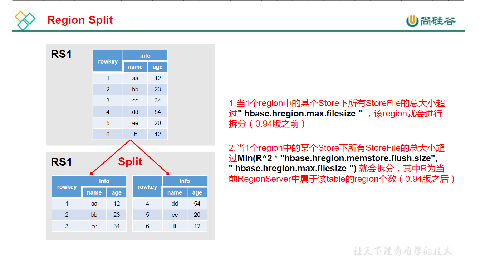

# HBase

## 第1章 HBase简介

### 1.1 HBase定义

​		HBase 是一种分布式、可扩展、支持海量数据存储的NoSQL 数据库。

### 1.2 HBase数据模型

​		逻辑上，HBase 的数据模型同关系型数据库很类似，数据存储在一张表中，有行有列。但从HBase 的底层物理存储结构（K-V）来看，HBase 更像是一个multi-dimensional map。

#### 1.2.1 HBase逻辑结构


#### 1.2.2 HBase物理存储结构



#### 1.2.3 数据模型

1. **Name Space**

	​		命名空间，类似于关系型数据库的 DatabBase 概念，每个命名空间下有多个表。HBase有两个自带的命名空间，分别是 **hbase** 和 **default**，**hbase** 中存放的是 HBase 内置的表， **default**表是用户默认使用的命名空间。 

2. **Region**

	​		类似于关系型数据库的表概念。不同的是，HBase定义表时只需要声明列族即可，不需要声明具体的列。这意味着，往HBase写入数据时，字段可以动态、按需指定。因此，和关系型数据库相比，HBase能够轻松应对字段变更的场景。

3. **Row**

	​		HBase表中的每行数据都由一个RowKey和多个Column（列）组成，数据是按照 RowKey的**字典顺序**存储的，并且查询数据时**只能根据 RowKey** 进行检索，所以RowKey的设计十分重要。 

4. **Column**

	​		HBase中的每个列都由 Column Family(列族)和Column Qualifier（列限定符）进行限定，例如info：name，info：age。建表时，只需指明列族，而列限定符无需预先定义。

5. **Time Stamp**

	​		用于标识数据的不同版本（version），每条数据写入时，如果不指定时间戳，系统会自动为其加上该字段，其值为写入 HBase的时间。 

6. **Cell**

	​		由{rowkey, column Family：column Qualifier, time Stamp} 唯一确定的单元。cell 中的数据是没有类型的，全部是字节码形式存贮。

### 1.3 HBase基本架构



1. **Region Server**

	​		Region Server为 Region的管理者，其实现类为 HRegionServer，主要作用如下: 

	​		对于数据的操作：get, put, delete； 
	​		对于Region的操作：splitRegion、compactRegion。 

2. **Master**

	​		Master是所有Region Server的管理者，其实现类为 HMaster，主要作用如下： 
	​		对于表的操作：create, delete, alter 
	​		对于RegionServer的操作：分配regions到每个RegionServer，监控每个RegionServer

3. **Zookeeper**

	​		HBase 通过Zookeeper 来做 Master 的高可用、RegionServer 的监控、元数据的入口以及集群配置的维护等工作。 

4. **HDFS**

	​		HDFS 为HBase 提供最终的底层数据存储服务，同时为HBase 提供高可用的支持。 

## 第2章 HBase快速入门

### 2.1 HBase 安装部署

#### 2.1.1 Zookeeper部署

#### 2.1.2 Hadoop部署

#### 2.1.3 Hbase部署

1. hbase-env.sh

	```sh
	export JAVA_HOME= 
	export HBASE_MANAGES_ZK=false 
	```

2. hbase-site.xml

	```xml
	   <property>
	        <name>hbase.rootdir</name>
	        <value>hdfs://master:9000/hbase</value> 
	    </property> 
	    <property>
	        <name>hbase.cluster.distributed</name>
	        <value>true</value>
	    </property>
	    <property>
	        <name>hbase.master.port</name> 
	        <value>16000</value> 
	    </property>
	    <property>
	        <name>hbase.zookeeper.quorum</name>
	        <value>master,slave01,slave02</value>
	    </property> 
	    <property>
	        <name>hbase.zookeeper.property.dataDir</name>
	        <value>/home/neu/data/zkdata</value>
	    </property> 
	    <property>
	        <name>hbase.unsafe.stream.capability.enforce</name>
	        <value>false</value>
	    </property>
	```

3. regionservers

	```
	master
	slave01
	slave02
	```

4. 软连接core-site.xml&hdfs-site.xml 到conf目录下
5. 分发到其他机器
6. 启动服务  webUI 16010

### 2.2 HBase Shell操作

#### 2.2.1 基本操作

1. 进入HBase客户端  hbase shell
2. 查看帮助 help
3. 查看所有表  list

#### 2.2.2 表的操作

1. 创建表

	create 'student','info'

2. 插入数据

	put 'student','1001','info:sex','male'

3. 扫描表

	scan 'student'

4. 查看表结构

	describe 'student',{STARTROW=>'1001',STOPROW=>'1001'}

5. 更新指定字段数据

	put 'student','1001','info:name','Nick'

6. 查看指定行或列族列数据

	get 'student','1001',{COLUMN=>‘info:name’,VERSION=>3}

7. 统计表行数

	count 'student'

8. 删除数据

	deleteall 'student','1001'

	delete 'student','1001','info:sex'

9. 清空表数据

	truncate 'student'

10. 删除表

	disable 'student'

	drop 'student'

11. 变更表信息

	alter 'student',{NAME=>'info',VERSION=>3}

## 第3章 HBase进阶

### 3.1 架构原理



1. StoreFile

	​		保存实际数据的物理文件，StoreFile 以 HFile 的形式存储在 HDFS 上。每个 Store 会有一个或多个StoreFile（HFile），数据在每个StoreFile 中都是有序的。

2. MemStore

	​		写缓存，由于HFile 中的数据要求是有序的，所以数据是先存储在MemStore 中，排好序后，等到达刷写时机才会刷写到HFile，每次刷写都会形成一个新的HFile。

3. WAL

	​		由于数据要经 MemStore 排序后才能刷写到 HFile，但把数据保存在内存中会有很高的概率导致数据丢失，为了解决这个问题，数据会先写在一个叫做 Write-Ahead logfile 的文件中，然后再写入MemStore 中。所以在系统出现故障的时候，数据可以通过这个日志文件重建。

### 3.2 写流程



1. Client 先访问zookeeper，获取hbase:meta 表位于哪个Region Server。 
2. 访问对应的 Region Server，获取 hbase:meta 表，根据读请求的 namespace:table/rowkey，查询出目标数据位于哪个 Region Server 中的哪个 Region 中。并将该 table 的 region 信息以及meta 表的位置信息缓存在客户端的 meta cache，方便下次访问。 
3. 与目标Region Server 进行通讯； 
4. 将数据顺序写入（追加）到 WAL； 
5. 将数据写入对应的 MemStore，数据会在MemStore 进行排序； 
6. 向客户端发送ack； 
7. 等达到MemStore 的刷写时机后，将数据刷写到HFile。 

### 3.3 MemStore Flush

1. 当某个 memstroe 的大小达到了 hbase.hregion.memstore.flush.size（默认值 128M），其所在region 的所有 memstore 都会刷写。

	​		 当memstore 的大小达到了 **hbase.hregion.memstore.flush.size（默认值128M)* hbase.hregion.memstore.block.multiplier（默认值4）**时，会阻止继续往该 memstore 写数据。 

2. 2.当region server 中memstore 的总大小达到 **java_heapsize \*hbase.regionserver.global.memstore.size（默认值0.4）*hbase.regionserver.global.memstore.size.lower.limit（默认值0.95**），region 会按照其所有 memstore 的大小顺序（由大到小）依次进行刷写。直到 region server中所有memstore 的总大小减小到上述值以下。 

	​		当region server 中memstore 的总大小达到 **java_heapsize*hbase.regionserver.global.memstore.size（默认值0.4）** 时，会阻止继续往所有的memstore 写数据。

3. 到达自动刷写的时间，也会触发memstore flush。自动刷新的时间间隔由该属性进行配置**hbase.regionserver.optionalcacheflushinterval（默认1 小时）**。 
4. 4.当 WAL 文件的数量超过 hbase.regionserver.max.logs，region 会按照时间顺序依次进行刷写，直到 WAL 文件数量减小到 hbase.regionserver.max.log 以下（该属性名已经废弃，现无需手动设置，最大值为 32）。 

### 3.4 读流程



读流程 

1. Client 先访问zookeeper，获取hbase:meta 表位于哪个Region Server。 
2. 访问对应的 Region Server，获取 hbase:meta 表，根据读请求的 namespace:table/rowkey，查询出目标数据位于哪个 Region Server 中的哪个 Region 中。并将该 table 的 region 信息以及meta 表的位置信息缓存在客户端的 meta cache，方便下次访问。 
3. 与目标Region Server 进行通讯； 
4. 分别在Block Cache（读缓存），MemStore 和 Store File（HFile）中查询目标数据，并将查到的所有数据进行合并。此处所有数据是指同一条数据的不同版本（time stamp）或者不同的类型（Put/Delete）。 
5.  将从文件中查询到的数据块（Block，HFile 数据存储单元，默认大小为64KB）缓存到Block Cache。 
6. 将合并后的最终结果返回给客户端。 

### 3.5 StoreFile Compaction

​		由于memstore 每次刷写都会生成一个新的HFile，且同一个字段的不同版本（timestamp）和不同类型（Put/Delete）有可能会分布在不同的HFile 中，因此查询时需要遍历所有的HFile。为了减少HFile 的个数，以及清理掉过期和删除的数据，会进行 StoreFile Compaction。 

​		Compaction 分为两种，分别是 **Minor Compaction** 和**Major Compaction**。Minor Compaction会将临近的若干个较小的 HFile 合并成一个较大的 HFile，但不会清理过期和删除的数据。Major Compaction 会将一个 Store 下的所有的 HFile 合并成一个大 HFile，并且会清理掉过期和删除的数据。 



### 3.6 Region Split

​		默认情况下，每个 Table 起初只有一个Region，随着数据的不断写入，Region 会自动进行拆分。刚拆分时，两个子 Region 都位于当前的 Region Server，但处于负载均衡的考虑， HMaster 有可能会将某个 Region 转移给其他的Region Server。

​		Region Split 时机： 

1. 当1个region中的某个Store下所有StoreFile 的总大小超过hbase.hregion.max.filesize，该Region 就会进行拆分（0.94 版本之前）。 

2. 当 1 个 region 中的某个 Store 下所有 StoreFile 的总大小超过 Min(R^2 *"hbase.hregion.memstore.flush.size",hbase.hregion.max.filesize")，该Region 就会进行拆分，其中R 为当前Region Server 中属于该Table 的个数（0.94 版本之后）。

 

### 3.7 与Hive集成

```shell
ln -s $HBASE_HOME/lib/hbase-common-1.3.1.jar $HIVE_HOME/lib/hbase-common-1.3.1.jar 
ln -s $HBASE_HOME/lib/hbase-server-1.3.1.jar $HIVE_HOME/lib/hbase-server-1.3.1.jar 
ln -s $HBASE_HOME/lib/hbase-client-1.3.1.jar $HIVE_HOME/lib/hbase-client-1.3.1.jar 
ln -s $HBASE_HOME/lib/hbase-protocol-1.3.1.jar $HIVE_HOME/lib/hbase-protocol-1.3.1.jar 
ln -s $HBASE_HOME/lib/hbase-it-1.3.1.jar $HIVE_HOME/lib/hbase-it- 1.3.1.jar 
ln -s $HBASE_HOME/lib/htrace-core-3.1.0-incubating.jar $HIVE_HOME/lib/htrace-core-3.1.0-incubating.jar 
ln -s $HBASE_HOME/lib/hbase-hadoop2-compat-1.3.1.jar $HIVE_HOME/lib/hbase-hadoop2-compat-1.3.1.jar 
ln -s $HBASE_HOME/lib/hbase-hadoop-compat-1.3.1.jar $HIVE_HOME/lib/hbase-hadoop-compat-1.3.1.jar 
同时在hive-site.xml 中修改 zookeeper 的属性，如下：
hive.zookeeper.quorum
hive.zookeeper.client.port
```

1. Hive
	+ 数据仓库 
		Hive 的本质其实就相当于将 HDFS 中已经存储的文件在 Mysql 中做了一个双射关系，以方便使用HQL 去管理查询。 
	+ 用于数据分析、清洗 
		Hive 适用于离线的数据分析和清洗，延迟较高。 
	+ 基于HDFS、MapReduce 
		Hive 存储的数据依旧在DataNode 上，编写的HQL 语句终将是转换为MapReduce 代码执行。 
2. HBase
	+ 数据库 
		是一种面向列族存储的非关系型数据库。 
	+ 用于存储结构化和非结构化的数据 
		适用于单表非关系型数据的存储，不适合做关联查询，类似JOIN 等操作。 
	+ 基于HDFS 
		数据持久化存储的体现形式是HFile，存放于 DataNode 中，被ResionServer 以region 的形式进行管理。 
	+ 延迟较低，接入在线业务使用 
		面对大量的企业数据，HBase 可以直线单表大量数据的存储，同时提供了高效的数据访问速度。 

## 示例程序运行

```shell
hadoop jar lib/hbase-mapreduce-2.2.2.jar rowcounter weibo
hadoop jar lib/hbase-mapreduce-2.2.2.jar importtsv -Dimporttsv.columns=HBASE_ROW_KEY,info:name,info:color fruit hdfs://master:9000/fruit.tsv
```
## 复制数据
```shell
hadoop jar hbase-1.0-SNAPSHOT.jar com.atguigu.mr.FruitDriver fruit fruit1
```
## 导入数据
```shell
hadoop jar lib/hbase-mapreduce-2.2.2.jar importtsv -Dimporttsv.separator=',' -Dimporttsv.columns=info:name,HBASE_ROW_KEY,info:url,info:focus weibo hdfs://master:9000/hivedatas/test/test.csv

hbase-daemon.sh stop thrift
```


