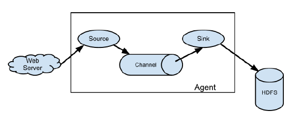

# Flume
## 一、flume概述
### 1. 定义
        Flume 是Cloudera 提供的一个高可用的，高可靠的，分布式的海量日志采集、聚合和传输的系统。Flume 基于流式架构，灵活简单。
### 2. flume基础架构

#### 2.1 Agent
        Agent是一个JVM 进程，它以事件的形式将数据从源头送至目的。 Agent主要有3个部分组成，Source、Channel、Sink。
#### 2.2 source
        Source是负责接收数据到Flume Agent的组件。Source组件可以处理各种类型、各种格式的日志数据，包括avro、thrift、exec、jms、spooling directory、netcat、sequence generator、syslog、http、legacy。 
#### 2.3 channel
        Channel是位于Source 和Sink 之间的缓冲区。因此，Channel允许Source 和Sink运作在不同的速率上。Channel 是线程安全的，可以同时处理几个 Source 的写入操作和几个Sink的读取操作。   

        Flume自带两种Channel：Memory Channel和 File Channel以及Kafka Channel。

        Memory Channel是内存中的队列。Memory Channel在不需要关心数据丢失的情景下适用。如果需要关心数据丢失，那么 Memory Channel就不应该使用，因为程序死亡、机器宕机或者重启都会导致数据丢失。 

        File Channel 将所有事件写到磁盘。因此在程序关闭或机器宕机的情况下不会丢失数
