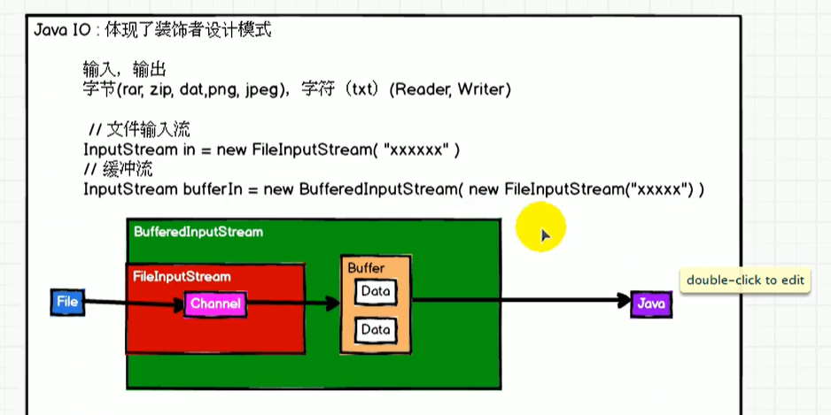
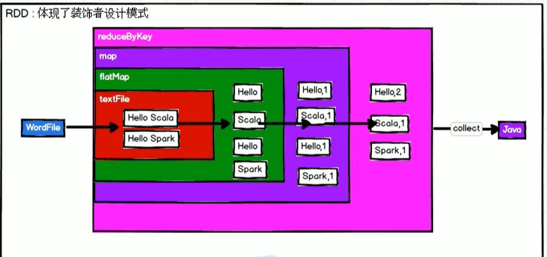

# Spark

##  第1章 Spark概述

### 1.1	什么是Spark

### 1.2	Spark内置模块

​	Spark Core：实现了Spark的基本功能，包含任务调度、内存管理、错误恢复、与存储系统交互等模块。Spark Core中还包含了对弹性分布式数据集(Resilient Distributed DataSet，简称RDD)的API定义。 
​	Spark SQL：是Spark用来操作结构化数据的程序包。通过Spark SQL，我们可以使用 SQL或者Apache Hive版本的SQL方言(HQL)来查询数据。Spark SQL支持多种数据源，比如Hive表、Parquet以及JSON等。 
​	Spark Streaming：是Spark提供的对实时数据进行流式计算的组件。提供了用来操作数据流的API，并且与Spark Core中的 RDD API高度对应。 
​	Spark MLlib：提供常见的机器学习(ML)功能的程序库。包括分类、回归、聚类、协同过滤等，还提供了模型评估、数据 导入等额外的支持功能。 
​	集群管理器：Spark 设计为可以高效地在一个计算节点到数千个计算节点之间伸缩计 算。为了实现这样的要求，同时获得最大灵活性，Spark支持在各种集群管理器(Cluster Manager)上运行，包括Hadoop YARN、Apache Mesos，以及Spark自带的一个简易调度 器，叫作独立调度器。 
​	 Spark得到了众多大数据公司的支持，这些公司包括Hortonworks、IBM、Intel、Cloudera、MapR、Pivotal、百度、阿里、腾讯、京东、携程、优酷土豆。当前百度的Spark已应用于大搜索、直达号、百度大数据等业务；阿里利用GraphX构建了大规模的图计算和图挖掘系统，实现了很多生产系统的推荐算法；腾讯Spark集群达到8000台的规模，是当前已知的世界上最大的Spark集群。

### 1.3 Spark特点

## 第2章 Spark运行模式

### 2.1 Spark安装地址

#### 1．官网地址

​	http://spark.apache.org/

#### 2．文档查看地址

​	https://spark.apache.org/docs/2.1.1/

#### 3．下载地址

​	https://spark.apache.org/downloads.html

### 2.2 重要角色

#### 2.2.1 Driver（驱动器）

​	Spark的驱动器是执行开发程序中的main方法的进程。它负责开发人员编写的用来创建SparkContext、创建RDD，以及进行RDD的转化操作和行动操作代码的执行。如果你是用spark shell，那么当你启动Spark shell的时候，系统后台自启了一个Spark驱动器程序，就是在Spark shell中预加载的一个叫作 sc的SparkContext对象。如果驱动器程序终止，那么Spark应用也就结束了。主要负责：

1. 把用户程序转为作业（JOB）

2. 跟踪Executor的运行状况
3. 为执行器节点调度任务
4. UI展示应用运行状况

#### 2.2.2 Executor（执行器）

​	Spark Executor是一个工作进程，负责在 Spark 作业中运行任务，任务间相互独立。Spark 应用启动时，Executor节点被同时启动，并且始终伴随着整个 Spark 应用的生命周期而存在。如果有Executor节点发生了故障或崩溃，Spark 应用也可以继续执行，会将出错节点上的任务调度到其他Executor节点上继续运行。主要负责：
​	1）负责运行组成 Spark 应用的任务，并将结果返回给驱动器进程；
​	2）通过自身的块管理器（Block Manager）为用户程序中要求缓存的RDD提供内存式存储。RDD是直接缓存在Executor进程内的，因此任务可以在运行时充分利用缓存数据加速运算。

### 2.3 Local模式

#### 2.3.1 概述

#### 2.3.2 安装使用

+ 上传并解压spark安装包

   tar -zxvf spark-2.1.1-bin-hadoop2.7.tgz -C /opt/module/
   mv spark-2.1.1-bin-hadoop2.7 spark

+ 官方求PI案例

   bin/spark-submit \
     --class org.apache.spark.examples.SparkPi \
     --executor-memory 1G \
     --total-executor-cores 2 \
     ./examples/jars/spark-examples_2.11-2.1.1.jar \
     100

+ 基本语法

  bin/spark-submit \
  --class <main-class>
  --master <master-url> \
  --deploy-mode <deploy-mode> \
  --conf <key>=<value> \
  ... # other options
  <application-jar> \
  [application-arguments]

+ 参数说明：

  --master 指定Master的地址，默认为Local
  --class: 你的应用的启动类 (如 org.apache.spark.examples.SparkPi)
  --deploy-mode: 是否发布你的驱动到worker节点(cluster) 或者作为一个本地客户端 (client) (default: client)*
  --conf: 任意的Spark配置属性， 格式key=value. 如果值包含空格，可以加引号“key=value” 
  application-jar: 打包好的应用jar,包含依赖. 这个URL在集群中全局可见。 比如hdfs:// 共享存储系统， 如果是 file:// path， 那么所有的节点的path都包含同样的jar
  application-arguments: 传给main()方法的参数
  --executor-memory 1G 指定每个executor可用内存为1G
  --total-executor-cores 2 指定每个executor使用的cup核数为2个

+ 结果展示

  该算法是利用蒙特·卡罗算法求PI

+ 准备文件

   mkdir input
     在input下创建3个文件1.txt和2.txt，并输入以下内容
     hello atguigu
     hello spark

+ 启动spark-shell

+ 运行WordCount程序

  scala>sc.textFile("input").flatMap(_.split(" ")).map((_,1)).reduceByKey(_+_).collect
  res0: Array[(String, Int)] = Array((hadoop,6), (oozie,3), (spark,3), (hive,3), (atguigu,3), (hbase,6))

+ WordCount程序分析：

+ 数据流分析：

  textFile("input")：读取本地文件input文件夹数据；
  flatMap(_.split(" "))：压平操作，按照空格分割符将一行数据映射成一个个单词；
  map((_,1))：对每一个元素操作，将单词映射为元组；
  reduceByKey(_+_)：按照key将值进行聚合，相加；
  collect：将数据收集到Driver端展示。

### 2.4 Standalone模式

#### 2.4.1 概述

​	构建一个由Master+Slave构成的Spark集群，Spark运行在集群中。

#### 2.4.2 安装使用

1. 进入spark安装目录下的conf文件夹

   [atguigu@master module]$ cd spark/conf/

2. 修改配置文件名称

   [atguigu@master conf]$ mv slaves.template slaves
   [atguigu@master conf]$ mv spark-env.sh.template spark-env.sh

3. 修改slave文件，添加work节点：

   [atguigu@master conf]$ vim slaves

   master
   hadoop103
   hadoop104

4. 修改spark-env.sh文件，添加如下配置：

   [atguigu@master conf]$ vim spark-env.sh

   SPARK_MASTER_HOST=master
   SPARK_MASTER_PORT=7077

5. 分发spark包

   [atguigu@master module]$ xsync spark/

6. 启动

   [atguigu@master spark]$ sbin/start-all.sh
   [atguigu@master spark]$ util.sh 
   ================atguigu@master================
   3330 Jps
   3238 Worker
   3163 Master
   ================atguigu@hadoop103================
   2966 Jps
   2908 Worker
   ================atguigu@hadoop104================
   2978 Worker
   3036 Jps
   网页查看：master:8080
   注意：如果遇到 “JAVA_HOME not set” 异常，可以在sbin目录下的spark-config.sh 文件中加入如下配置：
   export JAVA_HOME=XXXX

7. 官方求PI案例

   [atguigu@master spark]$ bin/spark-submit \
   --class org.apache.spark.examples.SparkPi \
   --master spark://master:7077 \
   --executor-memory 1G \
   --total-executor-cores 2 \
   ./examples/jars/spark-examples_2.11-2.1.1.jar \
   100

8. 启动spark shell

   /opt/module/spark/bin/spark-shell \
   --master spark://master:7077 \
   --executor-memory 1g \
   --total-executor-cores 2
   参数：--master spark://master:7077指定要连接的集群的master
   执行WordCount程序
   scala>sc.textFile("input").flatMap(_.split(" ")).map((_,1)).reduceByKey(_+_).collect
   res0: Array[(String, Int)] = Array((hadoop,6), (oozie,3), (spark,3), (hive,3), (atguigu,3), (hbase,6))

#### 2.4.3 JobHistoryServer配置

1. 修改spark-default.conf.template名称

  ​[atguigu@master conf]$ mv spark-defaults.conf.template spark-defaults.conf

2. 修改spark-default.conf文件，开启Log：

   [atguigu@master conf]$ vi spark-defaults.conf
   spark.eventLog.enabled           true
   spark.eventLog.dir               hdfs://master:9000/directory
   注意：HDFS上的目录需要提前存在。
   [atguigu@master hadoop]$ hadoop fs –mkdir /directory

3. 修改spark-env.sh文件，添加如下配置：

   [atguigu@master conf]$ vi spark-env.sh

   export SPARK_HISTORY_OPTS="-Dspark.history.ui.port=18080 
   -Dspark.history.retainedApplications=30 
   -Dspark.history.fs.logDirectory=hdfs://master:9000/directory"
   参数描述：
   spark.eventLog.dir：Application在运行过程中所有的信息均记录在该属性指定的路径下； 
   spark.history.ui.port=18080  WEBUI访问的端口号为18080
   spark.history.fs.logDirectory=hdfs://master:9000/directory  配置了该属性后，在start-history-server.sh时就无需再显式的指定路径，Spark History Server页面只展示该指定路径下的信息
   spark.history.retainedApplications=30指定保存Application历史记录的个数，如果超过这个值，旧的应用程序信息将被删除，这个是内存中的应用数，而不是页面上显示的应用数。

4. 分发配置文件

   [atguigu@master conf]$ xsync spark-defaults.conf
   [atguigu@master conf]$ xsync spark-env.sh

5. 启动历史服务

   [atguigu@master spark]$ sbin/start-history-server.sh

6. 再次执行任务

   [atguigu@master spark]$ bin/spark-submit \
   --class org.apache.spark.examples.SparkPi \
   --master spark://master:7077 \
   --executor-memory 1G \
   --total-executor-cores 2 \
   ./examples/jars/spark-examples_2.11-2.1.1.jar \
   100

7. 查看历史服务

master:18080

#### 2.4.4 HA配置

1. zookeeper正常安装并启动

2. 修改spark-env.sh文件添加如下配置：

   [atguigu@master conf]$ vi spark-env.sh

   注释掉如下内容：

   SPARK_MASTER_HOST=master

   SPARK_MASTER_PORT=7077

   添加上如下内容：
   export SPARK_DAEMON_JAVA_OPTS="
   -Dspark.deploy.recoveryMode=ZOOKEEPER 
   -Dspark.deploy.zookeeper.url=master,hadoop103,hadoop104 
   -Dspark.deploy.zookeeper.dir=/spark"

3. 分发配置文件

   [atguigu@master conf]$ xsync spark-env.sh

4. 在master上启动全部节点

   [atguigu@master spark]$ sbin/start-all.sh

5. 在hadoop103上单独启动master节点

   [atguigu@hadoop103 spark]$ sbin/start-master.sh

6. spark HA集群访问

   /opt/module/spark/bin/spark-shell \
   --master spark://master:7077,hadoop103:7077 \
   --executor-memory 2g \
   --total-executor-cores 2

### 2.5 Yarn模式（重点）

#### 2.5.1 概述

​	Spark客户端直接连接Yarn，不需要额外构建Spark集群。有yarn-client和yarn-cluster两种模式，主要区别在于：Driver程序的运行节点。
​	yarn-client：Driver程序运行在客户端，适用于交互、调试，希望立即看到app的输出
​	yarn-cluster：Driver程序运行在由RM（ResourceManager）启动的AP（APPMaster）适用于生产环境。

#### 2.5.2 安装使用

1. 修改hadoop配置文件yarn-site.xml,添加如下内容：

   [atguigu@master hadoop]$ vi yarn-site.xml

        <!--是否启动一个线程检查每个任务正使用的物理内存量，如果任务超出分配值，则直接将其杀掉，默认是true -->
        <property>
                <name>yarn.nodemanager.pmem-check-enabled</name>
                <value>false</value>
        </property>
        <!--是否启动一个线程检查每个任务正使用的虚拟内存量，如果任务超出分配值，则直接将其杀掉，默认是true -->
        <property>
                <name>yarn.nodemanager.vmem-check-enabled</name>
                <value>false</value>
        </property>
2. 修改spark-env.sh，添加如下配置：

   [atguigu@master conf]$ vi spark-env.sh

   YARN_CONF_DIR=/opt/module/hadoop-2.7.2/etc/hadoop

3. 分发配置文件

   [atguigu@master conf]$ xsync /opt/module/hadoop-2.7.2/etc/hadoop/yarn-site.xml
   [atguigu@master conf]$ xsync spark-env.sh

4. 执行一个程序

   [atguigu@master spark]$ bin/spark-submit \
   --class org.apache.spark.examples.SparkPi \
   --master yarn \
   --deploy-mode client \
   ./examples/jars/spark-examples_2.11-2.1.1.jar \
   100
   注意：在提交任务之前需启动HDFS以及YARN集群。

#### 2.5.3 日志查看

1. 修改配置文件 spark-defaults.conf

   添加如下内容：
   ​	spark.yarn.historyServer.address=master:18080
   ​	spark.history.ui.port=18080

2. 重启spark历史服务

   [atguigu@master spark]$ sbin/stop-history-server.sh 
   stopping org.apache.spark.deploy.history.HistoryServer
   [atguigu@master spark]$ sbin/start-history-server.sh 
   starting org.apache.spark.deploy.history.HistoryServer, logging to /opt/module/spark/logs/spark-atguigu-org.apache.spark.deploy.history.HistoryServer-1-master.out

3. 提交任务到Yarn执行

   [atguigu@master spark]$ bin/spark-submit \
   --class org.apache.spark.examples.SparkPi \
   --master yarn \
   --deploy-mode client \
   ./examples/jars/spark-examples_2.11-2.1.1.jar \
   100

4. Web页面查看日志

### 2.6 Mesos模式(了解)

​	Spark客户端直接连接Mesos；不需要额外构建Spark集群。国内应用比较少，更多的是运用yarn调度。

### 2.7 几种模式对比

​	模式		Spark安装机器数	         需启动的进程		所属者
​	Local	         	 1	       		 	 	无	               		 Spark
​	Standalone		3	                 	Master及Worker	        Spark
​	Yarn			1				Yarn及HDFS			Hadoop

### 第3章 案例实操

​	Spark Shell仅在测试和验证我们的程序时使用的较多，在生产环境中，通常会在IDE中编制程序，然后打成jar包，然后提交到集群，最常用的是创建一个Maven项目，利用Maven来管理jar包的依赖。


### 3.1 编写WordCount程序

1. 创建一个Maven项目WordCount并导入依赖

```xml
<dependencies>
<dependency>
<groupId>org.apache.spark</groupId>
 <artifactId>spark-core_2.11</artifactId>
<version>2.1.1</version>
</dependency>
 </dependencies>
```

2. 编写代码

```scala
package com.atguigu

import org.apache.spark.{SparkConf, SparkContext}

object WordCount{

  def main(args: Array[String]): Unit = {

//1.创建SparkConf并设置App名称

val conf = new SparkConf().setAppName("WC")

//2.创建SparkContext，该对象是提交Spark App的入口

val sc = new SparkContext(conf)

//3.使用sc创建RDD并执行相应的transformation和action

sc.textFile(args(0)).flatMap(.split(" ")).map((, 1)).reduceByKey(+, 1).sortBy(.2, false).saveAsTextFile(args(1))

//4.关闭连接

sc.stop()

  }

}

```

3. 打包插件

```xml
 <plugin>
 <groupId>org.apache.maven.plugins</groupId>
 <artifactId>maven-assembly-plugin</artifactId>
 <version>3.0.0</version>
 <configuration>
     <archive>
         <manifest>
             <mainClass>WordCount</mainClass>
         </manifest>
     </archive>
     <descriptorRefs>
         <descriptorRef>jar-with-dependencies</descriptorRef>
     </descriptorRefs>
 </configuration>
 <executions>
     <execution>
         <id>make-assembly</id>
         <phase>package</phase>
         <goals>
             <goal>single</goal>
         </goals>
     </execution>
 </executions>

  </plugin>
```


4. 打包到集群测试

   ```xml
   bin/spark-submit \
   --class WordCount \
   --master spark://master:7077 \
   WordCount.jar \
   /word.txt \
   /out
   ```

### 3.2 本地调试

本地Spark程序调试需要使用local提交模式，即将本机当做运行环境，Master和Worker都为本机。运行时直接加断点调试即可。如下：
创建SparkConf的时候设置额外属性，表明本地执行：
val conf = new SparkConf().setAppName("WC").setMaster("local[*]")

    如果本机操作系统是windows，如果在程序中使用了hadoop相关的东西，比如写入文件到HDFS，则会遇到如下异常：

出现这个问题的原因，并不是程序的错误，而是用到了hadoop相关的服务，解决办法是将附加里面的hadoop-common-bin-2.7.3-x64.zip解压到任意目录。

在IDEA中配置Run Configuration，添加HADOOP_HOME变量


# 启动客户端
    spark-shell --master spark://master:7077
    spark-shell --master yarn
# 运行示例计算π值
    spark-submit --master spark://master:7077  --class org.apache.spark.examples.SparkPi ./spark/examples/jars/spark-examples_2.11-2.4.4.jar 10000
    spark-submit --class org.apache.spark.examples.SparkPi --master yarn --deploy-mode client spark/examples/jars/spark-examples_2.11-2.4.4.jar 100
# yarn模式图解
   
# javaIO
   

   
# RDD
   
